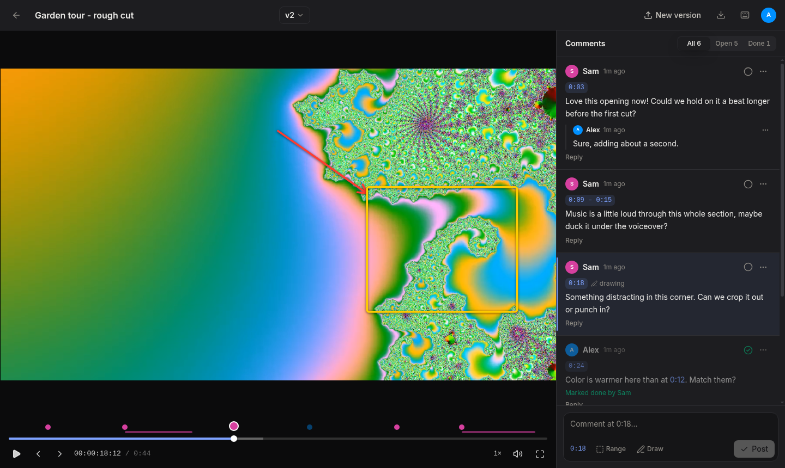
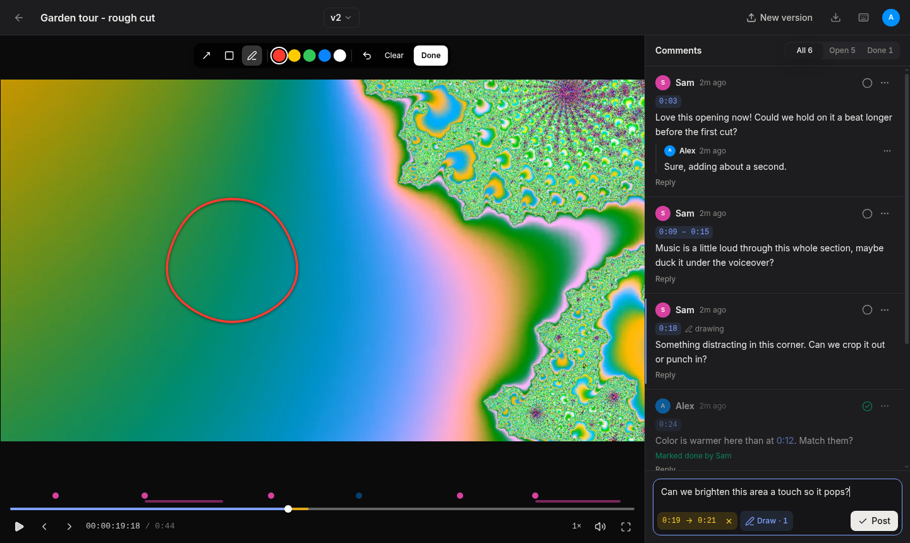
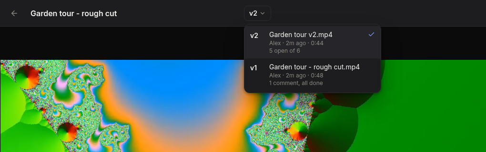
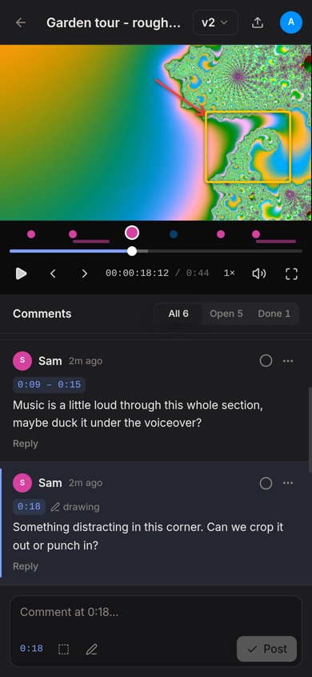
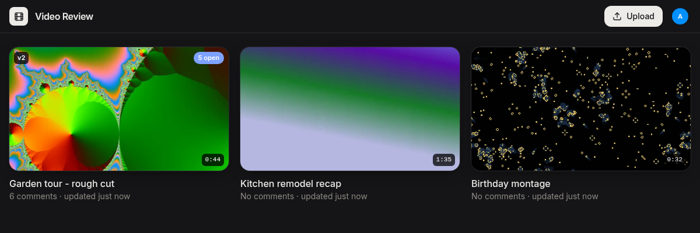

# Video Review

Upload a cut, watch it together, and leave comments pinned to the exact
moment, like lawn.video or Frame.io but running on your own machine for
everyone on your TailNet.



## What it does

**Time-stamped comments.** Pause anywhere and type. The comment is pinned to
that moment and shows up as a dot on the timeline, in the commenter's color.
Click the comment or its dot to jump straight there. Times typed in a comment
("warmer than at 0:12") become links too.

**Ranges and drawings.** Comment on a span (0:19–0:21) instead of a single
moment, and circle, box, or point at what you mean right on the frame. The
drawing reappears whenever someone jumps to that comment.



**Replies and "done".** Reply under a comment, and tick it off once it's fixed.
The Open and Done filters show what's left to do.

**Versions.** Upload the next cut onto the same video. Each version keeps its
own comments, and you can switch back to any earlier one. Someone halfway
through v1 isn't yanked to v2 when it lands. They get a banner instead.



**Works on a phone.** Same features, stacked for a small screen.

<p align="center">
  
</p>

**All your videos in one place.** Thumbnails, length, latest version, and how
many comments are still open.



## Run it

```sh
bun install      # first time only
bun run dev
```

Then open:

- **On the TailNet:** https://<machine>.<tailnet>.ts.net:5180 (no password)
- **Anyone, anywhere (optional):** https://<machine>.<tailnet>.ts.net (asks for
  the site password once per device; any username works)

The app only listens on `127.0.0.1`. Tailscale publishes it with one-time
settings that survive reboots:

```sh
tailscale serve  --bg --https=5180 http://127.0.0.1:5180   # tailnet, straight to the app
tailscale funnel --bg --https=443  http://127.0.0.1:5182   # public, through the password gate
tailscale funnel --https=443 off                           # stop public access
```

(Funnel only allows ports 443, 8443, and 10000. Use whichever one is free.)

### Speed on the home network

Video never goes through the internet when both devices are at home. Tailscale
connects devices on the same LAN directly (`tailscale status` shows
`direct 192.168.x.x`), so the tailnet URL moves files at LAN speed and still
works away from home. Uploads go in 16 MB chunks, and each chunk retries on
its own, so a Wi-Fi hiccup doesn't restart a big upload. Playback streams with
range requests, so you can seek before the whole file has downloaded.

### The password

`SITE_GATE_PASSWORD` in `.env.local` is only for public (Funnel) visitors.
People on the tailnet and this machine are never asked. Same gate as Idea
Board: the browser's password prompt, a 30-day cookie, and a 15-minute lockout
after ten wrong tries.

`bun run dev` starts four things:

| Process  | What it does |
|----------|--------------|
| `convex` | Local Convex backend (users, videos, versions, comments) on 127.0.0.1, data in `.convex/` |
| `web`    | Vite dev server on 127.0.0.1:5180. It proxies `/api` to Convex and `/media` to the media server, so that one port is all the browser needs. |
| `media`  | Media server on 127.0.0.1:5181 (`media/server.ts`): chunked uploads, playback, thumbnails. Files live in `data/` (override with `MEDIA_DIR`). |
| `gate`   | Password gate on 127.0.0.1:5182 in front of the web server, for public visitors. |

## How it works

- **Video files stay out of the database.** The media server writes uploads
  to `data/files/`. When an upload finishes, it uses ffmpeg to move the MP4's
  index to the front ("faststart", a copy without re-encoding) so playback
  starts instantly, and grabs a thumbnail. Convex only stores the file's id,
  name, size, duration, resolution, and frame rate.
- **Comments sync live** through Convex, so a comment shows up on everyone's
  screen as soon as it's posted.
- **Drawings** are stored as shapes in 0..1 frame coordinates, so they line up
  at any player size.
- **Who you are** is a name and color picked on first visit, remembered per
  browser (no accounts), the same as Idea Board.

Needs `ffmpeg` and `ffprobe` on the PATH. Uploads should be MP4 (H.264), which
is what browsers play.

## Keyboard shortcuts

Press `?` on a video. The main ones: Space/K play, ←/→ ±5 s, `,`/`.` step a
frame, C comment, I/O set a range, D draw, F fullscreen.

## Layout

```
convex/   backend: schema, users, videos + versions, comments
media/    media server (uploads, range playback, thumbnails)
gate/     password gate for public visitors
src/      React app (player/ has the player, timeline, drawing, comments)
```
